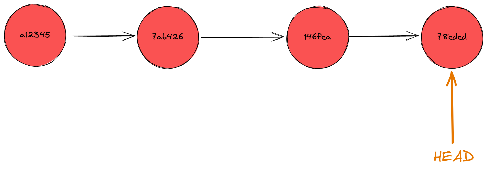
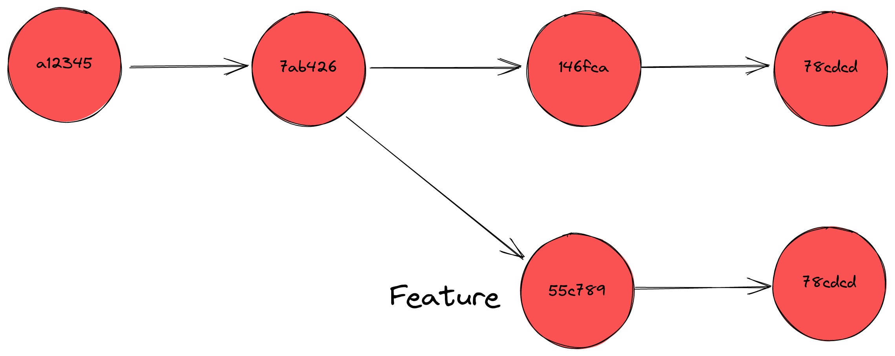
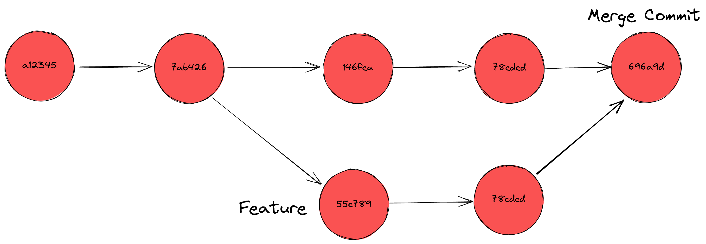

# <!--fit--> Versionskontrolle mit Git

Eine Einführung

https://github.com/yhatt/marp-cli-example

---

<div class="grid grid-cols-2 gap-4">
    <div>

## Motivation

-   bachelorarbeit.pdf
-   bacheloarbeitV2.pdf
-   bachelorarbeitV2-final.pdf
-   seminararbeit-finalv3.pdf

      </div>
      <div>

## Versionskontrolle

-   Organisations von Änderungen
-   Ziele:

    -   Nachvollziehbare Änderungen
    -   Zugriff auf alte Versionen
    -   Austauschen von Änderungen

            </div>

        </div>

---


## Pull Request

-   TODO

---

## Merge Conflict

agjag


# Steckbrief

-   2005 von Linus Torvalds (der von Linux) initiiert
-   Hat nahezu alle alternativen verdrängt [1]
-   Entwicklung des Linux-Kernels
-   Dezentralität
    -   Jeder Nutzer besitzt vollständige Kopie

<sub>[1] [StackOverflow Developer Survey 2022](https://survey.stackoverflow.co/2022/#section-version-control-version-control-systems)</sub>


---

## TODO

---

# Erste Schritte

<div class="grid grid-cols-2 gap-4">
<div>

## Installation

**Windows**
<https://git-scm.com/download/win>

**OSX**
homebrew: <https://brew.sh/>

```sh
brew install git git-gui
```

**Linux**
Spezifischen Paketmanager nutzen, um `git` zu installieren

</div>
<div>

## Grafische Oberflächen

-   `git-gui` / `gitk` (Built-In)
-   TortoiseGit
-   GitKraken
-   Visual Studio Code / IntelliJ

        </div>

    </div>

---

# Wer bin ich?

```sh
git config --global user.name "Tobias Hund"
git config --global user.email "tobias.hund@innovation-hub.de"
```

---

# Git Repository einrichten

-   Repository ist ein versionierter Arbeitsbereich (Dateiverzeichnis)
-   Repositories können mit einem Server synchronisiert werden
-   Erzeugt oder bestehende verwendet

<div class="grid grid-cols-2 gap-4">
<div>

```sh
mkdir git-repo
cd git-repo
git init
```

</div>
<div>

```sh
git clone git@github.com:twobiers/talks.git
git clone https://github.com/twobiers/talks.git
```

</div>
</div>

---

# Commits und Arbeitszyklus

## Commits

-   Verwaltungseinheit vom Code
-   Atomare Änderung
-   Bestandteile:
    -   Autor
    -   Datum
    -   Nachricht ("Was wurde warum geändert?")
    -   Zeiger auf vorhergehenden Commit-Hash (SHA1)
    -   Code-Änderungen ("Diffs")

---

## Aufbau eines Commits

```
$ git log
commit 598b8c01a39d0c0ef3e965a3622c1e439be4ced6 (HEAD -> main)
Author: twobiers <22715034+twobiers@users.noreply.github.com>
Date:   Wed Nov 9 20:07:38 2022 +0100

    initialize git speaker deck
```

---

-   Commits basieren auf commits
-   Intern verkettete Liste


---

-   Spezieller HEAD Zeiger, zeigt aktuellen "Ort"



---

-   Kann verschoben werden


---

## Staging Area

-   Für einen Commit werden Änderungen in Staging Area verschoben
-   Nur das was in der Staging Area ist, landet im Commit


---

## How To Commit

### 1. Änderungen prüfen

```
$ git status
On branch main
Your branch is up to date with 'origin/main'.

Changes not staged for commit:
  (use "git add <file>..." to update what will be committed)
  (use "git restore <file>..." to discard changes in working directory)
	modified:   cards.md

Untracked files:
  (use "git add <file>..." to include in what will be committed)
	assets/commit-graph-branch.png
	assets/commit-graph-merge.png
```

---

### 2. Änderungen in Staging Area schieben

Gesamtes Verzeichnis: `git add .`
Bestimmte Datei: `git add cards.md`
Datei aus Staging Area nehmen: `git reset --staged cards.md`

---

### 3. Staging Area prüfen

```
$ git status
On branch main
Your branch is up to date with 'origin/main'.

Changes to be committed:
  (use "git restore --staged <file>..." to unstage)
	new file:   assets/commit-graph-branch.png
	new file:   assets/commit-graph-merge.png
	modified:   cards.md
```

---

### 4. Commit verfassen

```
$ git commit -m "Add git branching to cards"
```

---

### 5. Änderungen pushen

-   Commits sollten zeitnah gepusht werden

In den meisten Fällen geht das durch ein einfaches

```
$ git push
```

oder für einen nicht existierenden Branch

```
$ git push -u [target] [branch]
$ git push -u origin feature-branch
```

---

## Branching

-   "Abspalten" von einem Entwicklungsstand
-   Bspw. für Feature-Entwicklung losgekoppelt von dem Hauptstrang



---

## Merge

-   Zusammenführen von Branches



---

## Revert

-   Fehlerhafte Commits passieren
-   Git unterstützt es die Änderungen rückgängig zu machen
-   Dabei werden Änderungen über einen neuen Commit rückgängig gemacht
    -   Historie bleibt stabil

```
$ git revert 78cdcd
```

---

# Praktischer Durchlauf

<!--
git checkout git@github.com:twobiers/talks.git
git branch typo-fix
git checkout typo-fix
ÄNDERUNG MACHEN
git add .
git commit -m "fix a typo"
git push -u origin typo-fix
git checkout main

git pull

git merge typo-fix
git push
git log
git revert COMMIT-HASH
git push
-->

---

# Best Practices

## `push --force` vermeiden.

-   Überschreibt Änderungshistorie
-   Destruktive Aktion
-   Bearbeiter können mit ihrer Arbeit auf existierenden Commits basieren, die gelöscht werden

## Keine temporären Dateien einchecken

-   z.B. Editor-Dateien, `Thumbs.db`, `.DS_STORE`
-   Oder `node_modules`
-   `.gitignore` zum Ignorieren (<https://gitignore.io>)

---

# Best Practices

## Kleine, spezifische Commits

-   Kleinschrittiges Commiten
-   Aussagekräftige Commit-Nachricht

## Keine Geheimnisse einchecken

-   Schwer, aus alten Commits zu entfernen
-   Ggf. trotzdem rekonstruierbar (`git reflog`)

---

# Best Practices

## Conventional Commits

```
<type>[optional scope]: <description>

[optional body]

[optional footer(s)]
```

<https://www.conventionalcommits.org/>
